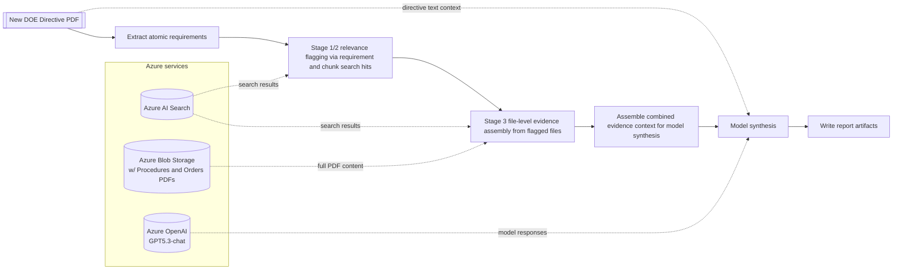

## DOE Directive Impact Analysis Pipeline

This workflow evaluates a new DOE directive and identifies which existing NETL orders and procedures likely need updates.

- Searches NETL order and procedure content for sections related to the new DOE directive.
- Reviews likely matches to see which documents may need updates.
- Produces a short report on what to update, why, and next steps.

## Pipeline Flow

## Notes

- Stage 1 and Stage 2 perform relevance flagging of candidate NETL documents using requirement-based and full-directive chunk search, respectively.
- Stage 3 performs file-level evidence assembly for those flagged files: file-specific matching snippets plus full-PDF text when available.
- Stage 3 is retrieval and evidence preparation; the LLM reasoning happens in the downstream model synthesis step.
- Model synthesis includes directive text context (baseline pass) in addition to evidence assembled from Stages 1/2/3.